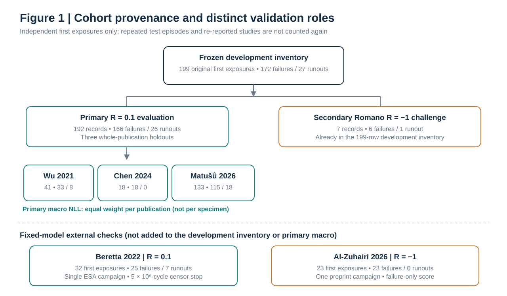
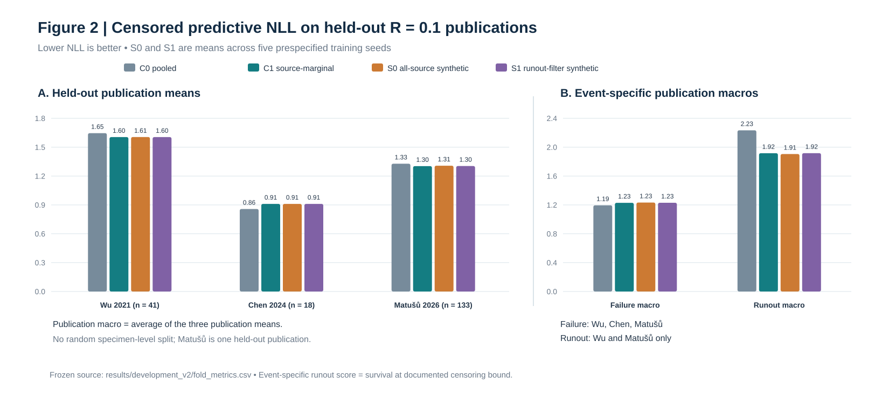

# Testing the limits of synthetic augmentation for censor-aware fatigue-life prediction in laser powder bed fused AlSi10Mg

**Manuscript status:** Integrated journal-neutral research-article draft (9 October 2026); scientific scores and frozen memberships unchanged.  
**Authors and affiliations:** To be confirmed by the corresponding author.  
**Citation style:** Author–year; final adjustment to journal instructions pending.

## Abstract

Published fatigue experiments on laser powder bed fused AlSi10Mg contain failures and right-censored runouts from different production campaigns. We tested whether synthetic training episodes improve life predictions when the evaluation publication is excluded from fitting. A frozen inventory comprised 199 first-exposure records; the primary analysis used 192 observations at a stress ratio of 0.1 (166 failures and 26 runouts) from three publications. We compared pooled and source-marginal experimental-only Weibull accelerated failure time models with two source-preserving augmentation arms: same-model parametric self-distillation and a fixed filter requiring observed runout support in the training source. Censored negative log likelihood was averaged equally across held-out publications. The source-marginal experimental baseline scored 1.27299, compared with 1.27449 for unrestricted augmentation and 1.27330 for the fixed filter; lower is better. Source adjustment improved runout likelihood relative to pooling while worsening failure likelihood. Neither augmentation arm showed a consistent improvement across publications or event types. Separately scored Beretta and Al-Zuhairi cohorts provide descriptive transfer checks under differing conditions, not independent confirmation of augmentation superiority. These results define an evidence-based limit for stress-only self-distillation and motivate future evaluation with specimen-linked pre-fatigue measurements and independent campaigns.

**Keywords:** Laser powder bed fusion; AlSi10Mg; fatigue-life prediction; right censoring; synthetic data augmentation; publication-held-out validation; source heterogeneity.

# 1. Introduction

## 1.1 Fatigue variability in LPBF AlSi10Mg

Laser powder bed fusion (LPBF) enables complex AlSi10Mg parts, but their fatigue response varies with defect population, build direction and surface condition. Wu et al. (2021) linked defect characteristics and loading direction to fatigue resistance, while van der Rest et al. (2025) varied contour parameters and post-treatments to examine roughness, subsurface porosity and fatigue. Across manufacturing campaigns, stress–life points therefore carry differences in material state and test protocol as well as stress. Models intended for another campaign need to account for this provenance and the scatter of fatigue life, rather than rely only on a fitted average curve.

## 1.2 Machine learning from experimental fatigue data

Machine learning has been used to link LPBF processing and defect information to fatigue response. Ciampaglia et al. (2023) modelled the effects of process settings and heat treatment in AlSi10Mg; Tridello et al. (2023b) inferred defect-distribution characteristics from process parameters; and Shi et al. (2023) combined interpolation with defect and loading descriptors for very-high-cycle life prediction. Srinivasan et al. (2024) used SMOTE and external-loop validation across epoxy polymers and AlSi10Mg, including failure-surface void characteristics. Those descriptors answer useful retrospective questions, but fracture-surface measurements cannot be assumed available for prediction before testing. Our harmonized comparison consequently fits stress amplitude only and retains processing information as source metadata.

## 1.3 Synthetic augmentation of sparse fatigue datasets

Interpolation and generative models can enlarge a training set without producing new fatigue experiments. Shi et al. (2023) used interpolation for AlSi10Mg, while Wang et al. (2025) proposed a multi-fidelity physics-informed framework for additively manufactured materials. Physical plausibility does not establish improved transfer: in a different domain, Mülkoğlu et al. (2026) combined censored S–N fitting with constrained generation for post-weld treated steels and found no mean improvement under leave-one-study-out evaluation. The present study examines a narrower intervention—source-preserving episodes sampled from a fitted probabilistic teacher—and tests whether it adds value over that teacher’s experimental-only model. It does not introduce a learned augmentation policy.

## 1.4 Runouts and prediction on unseen studies

A runout establishes survival beyond a stopping cycle, rather than failure at that cycle. Tridello et al. (2023a) include runout survival terms in a likelihood for fatigue scatter. Assessment also depends on what is held out: Di Maggio et al. (2025) emphasize that specimens within one Wöhler curve are grouped observations, and Mülkoğlu et al. (2026) evaluate augmentation by leaving out source studies. We therefore separate failure-density and runout-survival scores, hold out complete publications, and report stress ranges extending beyond training support. This asks whether predictions transfer to another reported campaign; with only three primary publications, it cannot establish a universal advantage.

## 1.5 Research gap, novelty statement and what this research work conveys

The audited AlSi10Mg literature yields first-exposure stress and outcome records, but no consistently verified join to numeric pre-fatigue defect or surface measurements for the specimens in the present modelling cohort. The focused question is whether synthetic episodes from a stress-based probabilistic model improve prediction when an entire publication is held out. This requires treating runouts as right-censored observations and comparing augmentation with an experimental-only model that accounts for source variation.

We assembled 199 first-exposure experimental records; the primary comparison uses 192 at stress ratio (R=0.1): 166 failures and 26 runouts from Wu et al. (2021), Chen et al. (2024) and Matušů et al. (2026). Each publication is held out in turn. Pooled and source-marginal Weibull accelerated failure time baselines are compared with source-preserving synthetic self-distillation and a prespecified filter requiring observed runout support in a training source. Synthetic episodes are training interventions, never additional experimental specimens. Censored negative log likelihood is averaged equally across held-out publications, with separate failure and runout diagnoses.

The contribution is a reproducible evaluation showing that this stress-only augmentation did not produce consistent gains across publications, while source adjustment changed failure and runout likelihood in opposing directions. The fixed filter is not a learned selection algorithm; generated episodes contain no independent physical measurements. The finding is bounded by the three primary publications, their (R=0.1) domain, and stress support. Feature-guided selective augmentation remains a future research question requiring specimen-linked pretest data and an untouched evaluation campaign.

# 2. Materials and methods

## 2.1 Experimental sources and provenance

We assembled published, numerically reported fatigue results for laser powder bed fused AlSi10Mg from four underlying publication groups. Wu et al. (2021) supplied Table 4 values; Chen et al. (2024) supplied smooth-specimen Tables 3–4; Matušů et al. (2026) supplied a linked experimental workbook; and Romano et al. (2018) supplied one underlying campaign with selected first-exposure values numerically re-reported by Tognan et al. (2023). The Romano and Tognan reports were linked to the same experiment, not counted as two independent publications. Each normalized record retains a source locator, original stress basis, stress ratio, test mode, outcome or stopping cycle, condition labels, and a source/publication group. Where a paper omitted original specimen identifiers, a local identifier preserves the table, group and row position without implying access to an unpublished specimen ID. Only source-table or source-workbook numeric records enter this cohort; approximate plot readings and generated records remain separate.

**Table 1.** Original first-exposure experimental sources, source-dependent censoring and evaluation role. Failure and runout counts refer to distinct first-exposure records, not repeated tests.

| Underlying publication group | Numeric source and included subset | Failures | Runouts | Total | Evaluation role |
| --- | --- | ---: | ---: | ---: | --- |
| Wu 2021 | Table 4, horizontal and vertical HCF specimens | 33 | 8 | 41 | Primary, (R=0.1) |
| Chen 2024 | Tables 3–4, smooth L40 and L10 specimens | 18 | 0 | 18 | Primary, (R=0.1) |
| Matušů 2026 | Workbook sheets 71–74, 91–94 and C01–C03; three platform families within one paper | 115 | 18 | 133 | Primary, (R=0.1) |
| Romano 2018, as re-reported by Tognan 2023 | Tables 1–2, individually adjudicated first exposures | 6 | 1 | 7 | Separate (R=-1) challenge |
| **All experimental first exposures** | **Four underlying groups** | **172** | **27** | **199** | **Primary track 192; separate challenge 7** |

Nominal stress amplitude was harmonized from each source’s documented stress basis and ratio; the original locator and source stress definition remain in the extraction ledgers. All included tests are uniaxial. Surface, heat-treatment, orientation, printer and powder descriptors are retained as provenance, not fitted as pooled specimen predictors. The modelling comparison uses stress amplitude only. Defects selected from fracture surfaces and condition-average roughness are not treated as prospectively available individual features.

## 2.2 First-exposure membership and overlap control

The unit of analysis is a specimen’s **initial constant-amplitude loading**, identified independently of any later loading on that specimen. An initial runout followed by a higher-stress retest contributes only its initial censored exposure; the later failure is not a second independent specimen. Wu contributes 41 tabulated initial tests. Chen contributes 18 failures from the two smooth groups; nine notched R5 failures are excluded because their reported stress is a local notch stress that is not directly comparable with the smooth-specimen nominal stress. Chen’s publication does not print original specimen IDs for these rows, so its retained IDs identify table and row position.

The Matušů workbook was screened against earlier papers and its retest suffixes. Series 41–44 were marked in the 2026 paper as previously reported and were excluded, including their later loadings. Within the additional platform families, 19 later loadings and one initial runout with the anonymous identifier 92/XX were also excluded. The retained 133 identified first exposures span three production platforms and 11 series, all assigned to the **single Matušů publication group**. For the Romano campaign, five records whose first-exposure event status could not be adjudicated were excluded; six failures and specimen 3’s original runout were retained. Tognan’s subsequent failure of specimen 3* was excluded as a dependent retest.

The frozen inventory thus has 199 unique record IDs. The primary analysis uses the 192 records at (R=0.1) from Wu, Chen and Matušů (166 failures, 26 runouts), holding out one whole publication at a time. Romano’s seven (R=-1) records (six failures, one runout) are reserved for a separately labelled ratio-transfer challenge and do not enter the primary folds. Platform series, repeat reports and retests are not counted as independent publication holdouts.

## 2.3 Failure and runout definitions

Each first-exposure record has a failure indicator and a cycle value. An observed fracture is coded as a failure at its reported cycle count. A specimen that survives its documented first-exposure stopping point is coded as **right-censored** at that point: its life exceeds or reaches the lower bound, rather than equalling an observed failure life. The source’s original bound operator is retained. Wu’s eight runouts are reported as (N>10^7); Matušů’s 18 are recorded at its method-defined (10^7)-cycle stop with (N\geq10^7). The precise instrument counts printed in the Matušů workbook remain in the source ledger and are not substituted for the study’s stated censoring stop. Romano specimen 3 is censored at its explicitly linked first-exposure count of 8,889,311 cycles, followed by an excluded retest at a higher stress. The retained Chen subset consists only of printed failures; its method-wide stopping policy does not justify manufacturing runout rows absent from the selected tables.

For probabilistic fitting and evaluation, failures provide information at the observed logarithmic life and runouts provide survival information at the logarithm of their recorded lower bound. The subsequent failure of a retested survivor never replaces that specimen’s initial right-censored outcome. Graph-only symbols with uncertain first-exposure linkage, unresolved outcome classes and synthetic episodes do not enter the 199 experimental rows or the held-out test sets.

**Figure 1.** Provenance and independent evaluation roles of the original fatigue observations. The 199-record development inventory separates into the 192-record primary R = 0.1 cohort and seven Romano R = −1 transfer records. Beretta and Al-Zuhairi are external fixed-model checks and do not increase the three-publication primary macro.

## 2.4 Experimental-only probabilistic models and held-out prediction

We compared two prespecified experimental-only baselines, C0 and C1. Both were fitted to the same original, exact first-exposure observations from the two training publications in each outer fold. The third publication was excluded in full, including all its treatment series and platform families. The primary folds comprised Wu (41 records), Chen (18), and Matušů (133), all at stress ratio R = 0.1. Source identifiers defined likelihood groups in C1; they were not supplied as transferable dummy predictors. Stress amplitude was the only specimen-level model input. In particular, process and surface labels, and postfracture measurements, did not enter these fits.

Let \(z_i=\log_{10}(N_i)\) and \(x_i=\log_2(\sigma_{a,i}/(100\,\mathrm{MPa}))\), where N_i is the observed failure cycle count or documented right-censoring bound. We set the log-life location, shape and cumulative hazard to

\[
\mu_i(b_s)=\alpha+\beta x_i+b_s,\qquad k=\exp(\kappa),\qquad H_i(z\mid b_s)=10^{k[z-\mu_i(b_s)]}.
\]

The conditional survivor function and density **with respect to log10 cycles** are

\[
S_Z(z\mid b_s)=\exp[-H_i(z\mid b_s)],\qquad
f_Z(z\mid b_s)=(\ln 10)kH_i(z\mid b_s)\exp[-H_i(z\mid b_s)].
\] With \(\delta_i=1\) for failure and \(\delta_i=0\) for a runout, the observed-data contribution is \(f_Z(z_i\mid b_s)^{\delta_i}S_Z(z_i\mid b_s)^{1-\delta_i}\). Thus a runout contributes the probability of surviving beyond its recorded bound; it is never treated as a failure at that cycle count. Log likelihoods and reported negative log likelihood scores use natural logarithms, while the life coordinate z uses base-10 logarithms.

**C0 (pooled E0).** We set b_s = 0 for every source and minimize the negative sum of the observed-data log likelihoods across the original training records. This gives one stress–life distribution shared by the training publications.

**C1 (source-marginal M1).** We allow one common offset b_s for every training publication, with b_s independently distributed as Normal(0, τ²). We fixed τ = 0.25 log10-cycle units in advance. For source s, all its real observations share the same b_s; its marginal likelihood is

\[
\mathcal L_s(\alpha,\beta,\kappa)=\int \phi(b;0,\tau^2)\prod_{i\in s}f_Z(z_i\mid b)^{\delta_i}S_Z(z_i\mid b)^{1-\delta_i}\,\mathrm{d}b.
\]

The fitted objective is −Σ_s log L_s. In particular, integration occurs **after multiplying the observations within a publication**, rather than treating their offsets as independent. The three parameters α, β and κ were optimized with bounded L-BFGS-B and deterministic multiple starts; τ was not estimated from held-out outcomes. The implemented bounds were α ∈ [0, 12], β ∈ [−12, 0], κ ∈ [−4, 3]. The integrals used 161-node Gauss–Hermite quadrature and were checked against 321 nodes with a 10⁻⁵ log-objective tolerance. These bounds and numerical checks apply to the implemented model and should be reported as such.

For a held-out publication, C1 predicts using a **new** offset \(b_{\mathrm{new}}\sim\mathcal N(0,\tau^2)\), integrated over its prior distribution. It does not estimate b_new from the held-out outcomes. Accordingly, the predictive failure density is ∫ f_Z(z | b_new) φ(b_new; 0, τ²) db_new, and the predictive runout probability is ∫ S_Z(c | b_new) φ(b_new; 0, τ²) db_new, where c is the specimen's recorded log10-cycle bound. C0 uses b_new = 0. We take the logarithm **after** integrating each predictive density or survival probability. The 161-node predictive calculation was checked against 321 nodes at a 10⁻⁵ per-record log-score tolerance. The held-out publication's stress values and recorded censoring bounds define the observations to be scored; its fatigue outcomes do not update either model before prediction.

For each test record the censored negative log likelihood is −δ_i log f̂_Z(z_i | σ_a,i) − (1−δ_i) log Ŝ_Z(c_i | σ_a,i), with the appropriate C0 or C1 predictive distribution. The primary summary averages record scores within each held-out publication and then gives the three publication means equal weight. Failure and runout contributions are also reported separately; Chen has no runouts in its selected test rows. This protocol evaluates transfer to a new publication rather than fit to another specimen from a known publication. Synthetic generation and the S0/S1 student fits are specified in the following Methods subsection.

## 2.5 Training-only synthetic augmentation and fixed source-selection strategy

### 2.5.1 Source-conditioned generation of synthetic fatigue episodes

The synthetic-data comparison was designed to test whether additional training episodes drawn from an already fitted fatigue-life model altered prediction on an unseen publication. Within each outer publication-held-out fold, the source-marginal experimental-only model C1 (Section 2.4) was fitted exclusively to the original first-exposure records in the two training publications. Its fitted parameters, \(\widehat{\theta}_{C1}=(\widehat{\alpha},\widehat{\beta},\widehat{\kappa})\), defined the probabilistic teacher; \(k=\exp(\kappa)\), the source-effect standard deviation \(\tau=0.25\), and the stress coordinate \(x=\log_2(\sigma_a/100\ \mathrm{MPa})\) retain the definitions in Section 2.4. No held-out fatigue outcome, source offset, or specimen-specific information entered teacher fitting or subsequent generation.

For each training publication \(s\), a source offset was sampled once per generation replicate from its posterior conditional on *real training observations*:

\[
p(b_s\mid D_{s,\mathrm{real}},\widehat{\theta}_{C1})
\ \propto\
\phi(b_s;0,\tau^2)
\prod_{i\in D_{s,\mathrm{real}}}
f_Z(z_i\mid b_s)^{\delta_i}
S_Z(z_i\mid b_s)^{1-\delta_i}.
\tag{2.5a}
\]

The implementation approximated this posterior on the 161-point Gaussian–Hermite quadrature grid used for the C1 likelihood, then drew one offset shared by all synthetic episodes from that publication in that replicate. The publication offset was therefore not resampled independently for each pseudo-observation.

A total of \(n_s\) synthetic episodes was generated for each eligible training publication, where \(n_s\) denotes its number of original training observations. Generation preserved the number of observations allocated to each recorded within-publication condition series: for each synthetic episode in a series, a real parent was selected with replacement from that same training series, and its measured nominal stress amplitude was reused. Thus the generator did not interpolate to new stresses, introduce unseen process combinations, or extend the series-specific measured stress support. Publication identity and condition-series provenance were retained in the separate generator ledger, but stress amplitude remained the sole specimen-level predictor in the fitted models.

At the sampled stress \(\sigma_{a,j}^{*}\) and shared source offset \(b_s^{*}\), latent logarithmic fatigue life was drawn by the inverse-transform construction

\[
z_{j,\mathrm{latent}}^{*}
=
\widehat{\alpha}
+\widehat{\beta}
\log_2(\sigma_{a,j}^{*}/100\ \mathrm{MPa})
+b_s^{*}
+\frac{\log_{10} E_j}{\widehat{k}},
\qquad E_j\sim\operatorname{Exp}(1),\quad
\widehat{k}=\exp(\widehat{\kappa}).
\tag{2.5b}
\]

The pre-score implementation rule rejected and redrew any \(z_{j,\mathrm{latent}}^{*}<0\), at the same parent stress and sampled source offset, until the simulated life represented at least one cycle. This explicitly conditions the synthetic draw on a physically countable life; the rejection counts were logged. A non-finite draw or more than 10,000 such rejections caused a replicate to be flagged rather than silently accepted.

### 2.5.2 Synthetic outcomes and the two augmentation arms

The three primary training publications document a common \(10^7\)-cycle testing stop, although the selected Chen records contain failures only. Each accepted latent draw was converted into a synthetic *observed* failure or right-censored episode at that stop:

\[
(\delta_j^{*},N_{j,\mathrm{obs}}^{*})
=
\begin{cases}
(1,10^{z_{j,\mathrm{latent}}^{*}}),
& z_{j,\mathrm{latent}}^{*}\leq 7,\\[2pt]
(0,10^7),
& z_{j,\mathrm{latent}}^{*}>7.
\end{cases}
\tag{2.5c}
\]

A synthetic runout accordingly represents survival to the specified bound, not failure at \(10^7\) cycles. The stopping decision was evaluated in logarithmic space to avoid exponentiating extremely long finite latent lives. Latent life and observed event/bound were kept distinct in the generation audit; only the latter contributed to student fitting.

Two augmentation arms were evaluated with the same source-marginal Weibull accelerated failure time model as C1. **S0**, the unrestricted self-distillation control, retained synthetic episodes from every training publication with the documented common stopping policy. **S1**, the fixed censor-support filter, retained only episodes belonging to a training publication with at least one *observed real training runout* at its documented stop. Under the frozen primary cohort, Wu and Matušů met this rule when present in training, whereas Chen did not. S1 omitted Chen-derived episodes even though Chen's methods describe the source-wide stopping policy; it did not select individual episodes on the basis of their generated failure/runout outcomes. For each fold and seed, S0 and S1 drew from the identical generated episode pool, so the arm difference was the predetermined source-eligibility rule rather than separate random generations. When Chen was held out, both remaining training publications met the rule, and S0 and S1 used identical synthetic observations.

The five generation seeds (13, 29, 47, 71 and 101) were fixed before comparison and applied separately within each outer training fold, with source-specific random streams. They represent stochastic repetitions of training augmentation on the same physical data, not additional experimental campaigns. S1 was a *fixed, source-level filter*, not a gate learned from test performance or a specimen-level utility model.

### 2.5.3 Weighted source-marginal student likelihood

Every original experimental training record retained unit likelihood weight. Within each eligible publication \(s\), every generated episode received weight \(w_{sj}=2/n_s\), such that the total *effective synthetic likelihood weight* per publication was two. This limit prevented a publication with more generated rows from receiving proportionally greater synthetic influence solely because of its original sample count. In S1, episodes from an ineligible publication were omitted (equivalently, assigned zero synthetic weight). The numerical count of generated rows was never interpreted as an increase in independent experimental specimens.

For augmentation arm \(a\in\{S0,S1\}\), the student was fitted by minimizing the negative log of the weighted source-marginal likelihood

\[
\mathcal{L}_{s}^{(a)}(\theta)
=
\int \phi(b;0,\tau^2)
\left[\prod_{i\in D_{s,\mathrm{real}}}
\ell_i(\theta,b)\right]
\left[\prod_{j\in D_{s,\mathrm{syn}}}
\ell_j^{*}(\theta,b)^{\,w_{sj}^{(a)}}\right]\,db,
\quad
\ell(z,\delta\mid\theta,b)=
f_Z(z\mid\theta,b)^{\delta}
S_Z(z\mid\theta,b)^{1-\delta},
\tag{2.5d}
\]

\[
\widehat{\theta}_{a}
=\arg\min_{\theta}
\left\{-\sum_{s\in\mathrm{training\ publications}}
\log\mathcal{L}_{s}^{(a)}(\theta)\right\}.
\tag{2.5e}
\]

Here \(D_{s,\mathrm{real}}\) contains original training outcomes, \(D_{s,\mathrm{syn}}\) contains that publication's generated episodes, and \(w_{sj}^{(a)}\) is \(2/n_s\) for an included episode and zero otherwise. The source-offset integral encloses the *joint* real and weighted synthetic conditional likelihoods for the publication: each pseudo-episode was not treated as a separate source with an independent random effect. Fractional synthetic weights make this a training-weighted likelihood intervention rather than a conventional likelihood for newly observed independent specimens. The original C1 teacher was not replaced by synthetic-only fitting; each S0 or S1 student was refitted to the same original training observations with the indicated additional weighted terms. The parameters, source-effect variance, numerical integration rules and optimization bounds followed Section 2.4.

### 2.5.4 Data separation and implementation safeguards

Teacher fitting, source-offset posterior calculation, parent sampling, stochastic generation, source filtering and student fitting were repeated *inside each outer training partition*. The excluded publication contributed neither observed outcomes nor generated episodes to fitting; its source offset was not inferred from its test data. The four fitted arms were evaluated only on original, held-out experimental records using the same censor-aware failure-density and runout-survival score defined in Section 2.4 and further specified in the validation protocol (Section 2.6).

The implementation checked frozen cohort and fold identities, first-exposure membership, publication disjointness, stress and censor-operator validity, source-stopping bounds, synthetic-ID uniqueness, numerical finiteness, optimizer convergence and 161-versus-321-node quadrature agreement. Synthetic records were stored separately from the experimental master with their fold, seed, publication, series, parent stress identifier, latent and observed lives, event indicator, stopping bound, sampled source offset, rejection count and arm-specific weights. The fitted-parameter and real-test prediction ledgers were likewise archived. No seed, effective-weight cap, eligibility rule or C1 source-effect variance was selected from outer-test results. Because the generator and student used the same parametric family and no independent pre-fatigue physical features, the augmentation arms assess self-distillation and weighting effects, **not** acquisition of new fatigue evidence or a learned selective-augmentation algorithm.

## 2.6 Publication-held-out validation, censor-aware scoring and external evaluation

### 2.6.1 Primary publication-held-out evaluation

The primary analysis evaluated predictive transfer to a publication excluded from fitting, rather than randomly withholding specimens from a known publication. The 192 original first-exposure observations at stress ratio \(R=0.1\) contained 166 failures and 26 right-censored runouts. They formed three leave-one-publication-out folds: Wu et al. (2021), 41 specimens (33 failures and eight runouts); Chen et al. (2024), 18 failures; and Matušů et al. (2026), 133 specimens (115 failures and 18 runouts). For each fold, the complete held-out publication, including every processing platform, condition series and runout, was excluded from training. The Matušů platform families and 11 series remained within one publication group rather than constituting multiple independent holdouts.

The other two publications supplied the experimental-only training observations for C0 and C1 (Section 2.4) and the training-only source-conditioned generation and fitting data for S0 and S1 (Section 2.5). Model estimation, teacher source-offset posterior calculations, synthetic parent selection, generation and student refitting were repeated within each fold without using that fold's test outcomes. All arms were scored on the identical original real-specimen test records; synthetic episodes never entered the evaluation cohort. C0 and C1 were evaluated once per fold, whereas S0 and S1 used the five prespecified random seeds 13, 29, 47, 71 and 101. Publication identifiers defined held-out units and source-effects groups, not transportable specimen-level predictors.

### 2.6.2 Censored predictive negative log likelihood

The primary endpoint was censored predictive negative log likelihood (NLL) on original held-out experimental first exposures. Let \(z_i=\log_{10}(N_i)\) be the recorded logarithmic failure life, \(c_i=\log_{10}(N_{\mathrm{stop},i})\) the recorded right-censoring lower bound, and \(\delta_i=1\) for a fracture and \(\delta_i=0\) for a runout. For model arm \(m\), the per-record loss was

\[
L_{i,m}=-\delta_i\ln \widehat f_{Z,m}(z_i\mid\sigma_{a,i})
-(1-\delta_i)\ln \widehat S_{Z,m}(c_i\mid\sigma_{a,i}),
\tag{2.6a}
\]

where \(\widehat f_{Z,m}\) is a predictive density **with respect to \(\log_{10}\) cycles**, \(\widehat S_{Z,m}\) is predictive survival at the documented censoring bound, and \(\ln\) denotes the natural logarithm. Lower NLL indicates better predictive likelihood for the recorded event or survival information. The original runout operator (\(>\) or \(\geq\)) was preserved in the provenance ledger; runouts were never recoded as failures at their stopping cycle.

The C0 predictive density and survivor used the pooled Weibull accelerated failure time model without publication effects. For C1, S0 and S1, a new unobserved publication offset \(b_{\mathrm{new}}\sim\mathcal N(0,0.25^2)\) was integrated over its *prior* distribution for every predictive density or survivor, following Section 2.4. A held-out publication offset was not estimated or updated from any of its failure or runout outcomes. Integration was performed on the density or survival probability before applying the logarithm. Recorded test censoring bounds were used for outcome scoring, not as new training evidence.

### 2.6.3 Publication macro, event-specific diagnostics and paired comparisons

For held-out publication \(s\) with \(n_s^{\mathrm{test}}\) original test observations, its mean NLL and the primary equal-publication macro NLL were

\[
\overline L_{s,m}
=\frac{1}{n_s^{\mathrm{test}}}\sum_{i\in D_{s,\mathrm{test}}}L_{i,m},
\qquad
L_{\mathrm{macro},m}
=\frac{1}{3}\sum_{s\in\mathcal P}\overline L_{s,m},
\quad \mathcal P=\{\mathrm{Wu,Chen,Matusu}\}.
\tag{2.6b}
\]

Each held-out publication contributed equally, irrespective of specimen count. The overall specimen-weighted mean over 192 test observations was also reported as a separate descriptive statistic because Matušů contributed 133 of the 192 records. The equal-publication macro, not the pooled specimen-weighted mean, was the predeclared primary statistic.

To identify compensating changes in predictive performance, failure-density scores and runout-survival scores were summarized separately within each publication. The failure macro averaged the publication-specific failure means over all three publications. The runout macro averaged the runout means over **Wu and Matušů only**, because Chen had no runouts in its selected test set. These event-specific scores were diagnostics of the same NLL, not independent fitting targets.

The primary experimental-only reference was C1. On paired original test observations and their unchanged event indicators and bounds, comparisons were expressed as

\[
\Delta_{i,m-C1}=L_{i,m}-L_{i,C1},
\qquad
\Delta_{\mathrm{macro},m-C1}
=L_{\mathrm{macro},m}-L_{\mathrm{macro},C1}.
\tag{2.6c}
\]

A negative difference represents an improvement in censored likelihood for the first named model, whereas a positive difference represents deterioration. S1 was additionally compared with S0 using the same test records. For S0 and S1, each fixed seed's held-out-publication and macro score was retained and reported, followed by the arithmetic mean and minimum–maximum over the five seeds. These seeds were repeated stochastic fits involving the same real test observations; they were not regarded as additional physical experiments or publication-level independent replicates. Mean absolute error of the predictive median in \(\log_{10}\)-cycle units was retained only as a secondary descriptive metric for actual failures, not for right-censored records.

### 2.6.4 Training stress support and the fixed augmentation decision rule

A whole-publication holdout may produce observations at stresses outside those available to the training publications. For each fold, the minimum and maximum stress amplitudes were determined solely from original real training records. Each test stress was flagged as within the training numerical support when

\[
\sigma_{a,\min}^{\mathrm{train}}
\leq \sigma_{a,i}^{\mathrm{test}}
\leq \sigma_{a,\max}^{\mathrm{train}}.
\tag{2.6d}
\]

Stress values below or above these limits were counted as out-of-support, and within-range and outside-range NLLs were reported separately. Numerical inclusion within the stress span was not assumed to establish physical-domain equivalence across process windows, heat treatments, specimen finishes, stress ratios or fatigue protocols. Stress-support diagnoses did not alter the primary macro, fitting rules or seed selection.

The precomparison protocol specified a conjunctive **preliminary-positive** criterion for selective augmentation. The five-seed mean S1 macro NLL had to be lower than **both** the C1 experimental-only macro and the S0 unrestricted synthetic macro; S1 also had to improve over C1 in at least two of the three held-out publication means; and neither its failure macro nor its runout macro could be higher than C1. If any element failed, the augmentation finding had to be reported as a trade-off or absence of consistent improvement, not a successful new algorithm based on one favorable seed, publication or event subtype. The primary analysis contained only three independent held-out publications, so the criterion was treated as an exploratory decision rule rather than a publication-level statistical superiority test.

### 2.6.5 Secondary ratio-transfer challenge and independent-source checks

The seven Romano et al. (2018) first exposures at \(R=-1\) (six failures, one runout) were evaluated as a **secondary ratio-transfer challenge**. The four arms were fitted on all 192 original \(R=0.1\) development records; synthetic training remained conditional on those same primary development publication groups. The seven Romano outcomes did not enter fitting, synthetic generation or model selection. Romano was already included in the 199-row frozen development inventory, so its challenge result was neither a fourth primary fold nor an untouched external validation study. The ratio shift was documented without fitting a stress-ratio coefficient absent from the primary stress-only model.

Two later, separately scored external sources reused the **archived all-192-record model fits** from the Romano-transfer fitting stage: one C0, one C1 and five fixed-seed fits each of S0 and S1. The model parameters and source-effect standard deviation were not refitted, calibrated or updated using either external source. For both sources, an outcome-masked file established the prediction membership and stress inputs. Full predictive parameters and medians were saved and committed **before** a strict specimen-identified outcome join and NLL calculation. This was a prediction-before-score procedure, not a fully outcome-unseen prospective trial: source outcome tables had already been inspected during literature intake.

**Beretta et al. (2022).** The source supplied 32 unique first-exposure cylindrical-specimen records from one experimental ESA campaign at \(R=0.1\): 25 failures and seven runouts censored at its documented \(5\times10^6\)-cycle stopping point. Eight later loading episodes on previously tested specimens were excluded. Original reported stress range \(\Delta\sigma\) was converted to nominal amplitude as \(\sigma_a=\Delta\sigma/2\) and cross-checked against the source ledger. The 32-record mean censored NLL was reported with separate 25-failure and seven-runout contributions; as-built and machined group comparisons were only descriptive strata within that one campaign. A reported failure at \(5.6\times10^6\) cycles beyond the stated source stop was retained without alteration in the main comparison, with a prespecified 31-record exclusion sensitivity using the same fixed models. All Beretta stress amplitudes were numerically inside the all-192 training stress span; finish and batch metadata were not fitted specimen predictors. Related ESA reanalyses were not counted as distinct experimental campaigns.

**Al-Zuhairi (2026 preprint).** The second source contained 23 specimen-identified 30 µm-process first-exposure **failures**, without documented runouts, at \(R=-1\). The included vertical as-built, vertical T6, horizontal T6 and 45° T6 conditions belonged to one preprint campaign, not four independent sources. Twelve 60 µm candidate records were excluded under the recorded overlap protocol; an unreported sixth vertical as-built record was not imputed. Failure-density NLL, median-life error and signed median prediction bias were descriptive metrics; no runout-survival score could be calculated. Stress amplitudes were numerically inside the all-192 training span, but the shift from \(R=0.1\) to \(R=-1\), orientation and treatment differences, and process conditions were not encoded as fitted effects.

These two external campaigns were reported separately from each other, from Romano and from the primary three-publication macro. S0/S1 external summaries retained all five original seed-level fits rather than choosing a favorable fit. The earlier Hamidi Nasab graph-based comparison used a different 66-record development fit of E0/M1 and was not an external check of the present S0/S1 protocol. Reserved Strauß–Löwisch and Kempf sources remained unscored. Differences from the fixed external checks were interpreted as descriptive transport observations, not an independent demonstration of synthetic augmentation superiority.

### 2.6.6 Auditability and limitations of validation

Reproducibility was supported by frozen cohort and fold tables, source-provenance ledgers, original Git blob identifiers, recorded exclusion and censoring rules, saved fit parameters, per-record held-out predictions, seed-specific metrics, synthetic-generation ledgers, and external forecast and score manifests. Input integrity, unique first-exposure IDs, true failure/runout coding, train–test publication separation, source-level stopping rules, stress basis, synthetic provenance and weights were checked. Bounded model fitting used 161-node Gaussian–Hermite integration with a separate 321-node numerical check. Absolute log-objective and prediction log-score differences were required to remain below \(10^{-5}\); convergence and exception checks were recorded without substituting new random seeds.

The primary evidence was limited by three independent publication groups, differences in runout frequency and incomplete specimen-linked prospective surface/defect metadata. The stress-only models did not identify causal effects of processing, heat treatment, orientation, stress ratio or pore characteristics. Synthetic episodes derived from the same fitted model family carried no independent material measurements and therefore tested a weighted self-distillation intervention, not a learned data-utility gate. The externally scored campaigns differed in loading domain, outcome mix and source-selection conditions and were not pooled to manufacture a larger publication count. These constraints set the interpretation boundary for the subsequent Results and Discussion.

# 3. Results

## 3.1 Publication-held-out performance of experimental-only and synthetic-augmented models

### 3.1.1 Predictive performance across the three held-out publications

The primary leave-one-publication-out evaluation used 192 original, numerically reported first-exposure fatigue records at stress ratio \(R=0.1\): 166 observed failures and 26 right-censored runouts. All models predicted the same real records from Wu et al. (2021; \(n=41\)), Chen et al. (2024; \(n=18\)) and Matušů et al. (2026; \(n=133\)) while each publication was excluded in turn from its training partition. Table 2 reports mean censored negative log likelihood (NLL; lower is better). C0 and C1 were fitted using real training observations only; the S0 and S1 entries are arithmetic means over the five prespecified training-generation seeds.

**Table 2.** Publication-held-out censored predictive NLL for the four frozen models. The primary macro is the unweighted mean of the three held-out-publication means. The pooled mean weights each of the 192 individual test records equally and is secondary. The S0 and S1 numbers are five-seed averages, not five independent experimental replications.

| Model arm | Wu (41; 33 failure / 8 runout) | Chen (18; 18 / 0) | Matušů (133; 115 / 18) | **Equal-publication macro NLL** | Pooled 192-record NLL |
| --- | ---: | ---: | ---: | ---: | ---: |
| C0 — pooled experimental Weibull AFT | 1.64587 | 0.85725 | 1.32829 | 1.27714 | 1.35194 |
| **C1 — source-marginal experimental Weibull AFT** | **1.60490** | 0.91078 | **1.30327** | **1.27299** | **1.33089** |
| S0 — all-source parametric self-distillation | 1.60536 | 0.91083 | 1.30726 | 1.27449 | 1.33375 |
| S1 — fixed observed-runout source filter | 1.60475 | 0.91083 | 1.30431 | 1.27330 | 1.33158 |

The experimental-only source-marginal model C1 attained the lowest **mean primary macro** NLL, 1.27299, compared with 1.27714 for the simpler pooled experimental model C0. That aggregate difference was not uniform across publications. C1 reduced the Wu score from 1.64587 to 1.60490 and the Matušů score from 1.32829 to 1.30327, but increased the Chen score from 0.85725 to 0.91078. The contrast shows that accounting for source-to-source variation changed the likelihood assigned to genuinely held-out fatigue outcomes in a publication-dependent way; the direction was not consistently favorable for every source.

Adding teacher-generated episodes did not reduce the five-seed mean macro NLL below C1. The unrestricted S0 mean was 1.27449, an increase of \(+0.00150\) relative to C1; the prespecified runout-supported S1 filter yielded 1.27330, an increase of \(+0.00031\) relative to C1. S1 was lower than S0 by 0.00119 NLL, but this relative gain over an augmented control did **not** amount to a gain over the real-only C1 reference. Relative to C1, S1 changed the three publication scores by approximately \(-0.00015\) on Wu, \(+0.00005\) on Chen and \(+0.00103\) on Matušů. Thus only **one of the three** held-out publications improved with S1. In the Chen-held-out fold, S0 and S1 were identical for each fixed seed because the two remaining training publications both contained observed real runouts and therefore both passed the fixed S1 eligibility rule.

The specimen-weighted NLL displayed the same broad ordering (C1, 1.33089; S1, 1.33158; S0, 1.33375; C0, 1.35194), although its numerical values differ from the publication macro because Matušů provides most of the individual test records. For that reason, the unweighted publication macro remains the principal cross-source metric; pooling individual records would otherwise give the single largest publication a disproportionate influence.

### 3.1.2 Failure-density and runout-survival trade-offs

The event-specific breakdown showed that the overall model rankings masked an important contrast between predicted failure density and predicted survival at documented stopping cycles. Table 3 gives separately the equal-publication mean NLL of observed failures and of right-censored runouts. The failure macro averages the three publication-specific failure scores. The runout macro averages **Wu and Matušů only** because the 18 selected Chen outcomes were all failures. These two quantities therefore have different contributing publication sets and should not be interpreted as a single uniformly weighted partition of the overall macro.

**Table 3.** Event-specific primary publication-held-out NLL (lower is better). For S0 and S1 the values are means over the five prespecified synthetic seeds. A failure contributes density in \(\log_{10}\) life; a runout contributes predictive survival at its source's documented bound.

| Model arm | Failure-density macro NLL (three publications) | Runout-survival macro NLL (Wu and Matušů) |
| --- | ---: | ---: |
| C0 | **1.19403** | 2.23383 |
| C1 | 1.22944 | 1.91623 |
| S0 | 1.23261 | **1.90529** |
| S1 | 1.22971 | 1.91716 |

Moving from C0 to C1 reduced the runout-survival macro NLL from 2.23383 to 1.91623, while increasing the failure-density macro from 1.19403 to 1.22944. The improved runout likelihood therefore coexisted with less favorable likelihood for observed failures. This trade-off is important in an experimental cohort with recorded runouts: the overall NLL alone would not reveal which event class drove the improvement.

Unrestricted S0 self-distillation reduced runout-survival macro NLL modestly relative to C1 (1.90529 versus 1.91623), but its failure-density macro worsened (1.23261 versus 1.22944) and its overall primary macro NLL increased. The fixed-filter S1 arm did not retain that small runout advantage: relative to C1, its failure macro rose from 1.22944 to 1.22971, and its runout macro rose from 1.91623 to 1.91716. The effect of synthetic training was consequently dependent on both the generation eligibility rule and the type of real fatigue outcome being scored. These results do not support the claim that preserving a real-runout source in a fixed synthetic filter is sufficient to improve performance on unseen publications.

### 3.1.3 Variation among the five fixed synthetic-generation seeds

The stochastic generation protocol used the same five predetermined seeds for S0 and S1, and all of them were retained. Table 4 reports the equal-publication macro NLL for each generation seed. C1, the fixed experimental-only comparator, remained at 1.27299 regardless of seed. A lower seed-specific score does not constitute a separate validation experiment because all seeds re-use the same three held-out original publications.

**Table 4.** Primary equal-publication macro NLL across fixed synthetic-generation seeds. The final column is S1 minus S0; a negative value favors S1 over S0 for that seed.

| Generation seed | S0 macro NLL | S1 macro NLL | S1 − S0 |
| ---: | ---: | ---: | ---: |
| 13 | 1.27546 | 1.27177 | −0.00369 |
| 29 | 1.27280 | 1.27457 | +0.00177 |
| 47 | 1.27592 | 1.27445 | −0.00148 |
| 71 | 1.27076 | 1.27193 | +0.00117 |
| 101 | 1.27748 | 1.27377 | −0.00371 |
| **Five-seed mean** | **1.27449** | **1.27330** | **−0.00119** |

S0 varied from 1.27076 to 1.27748 across the five seeds; S1 varied from 1.27177 to 1.27457. The direction of the S1–S0 contrast changed with the seed: S1 was better than S0 for seeds 13, 47 and 101, but worse for seeds 29 and 71. Some individual S0 and S1 seeds fell below the fixed C1 reference despite the respective **five-seed means** remaining above it. Selecting only those favorable realizations would therefore give a misleading picture of augmentation utility.

The seed comparison is also consistent with the limited intervention made by the filter. S1 used the same generated episodes as S0 but omitted synthetic contributions from Chen whenever Chen was a training publication; it did not learn a continuous specimen-level selection weight. Seed-level variation should consequently be understood as sensitivity to the fixed train-time self-distillation draw and source-eligibility decision, not as reproducibility across new physical experimental campaigns.

### 3.1.4 Stress-support diagnostics and primary decision

Publication-held-out testing exposed extrapolation relative to the stresses measured in the two training publications. Seven Wu test observations fell below the 30 MPa training-fold minimum, whereas 41 Matušů test failures exceeded the 99 MPa training-fold maximum. All 18 Chen test observations were within the training-fold stress span. These classifications were determined from the original real training stresses before evaluation and did not change the primary fold scores or macro.

For the seven below-range Wu records, the C1 and S1 mean censored NLL values were 1.34983 and 1.34952, respectively. For the 41 above-range Matušů failures, the corresponding values were 1.20896 and 1.21107. The S1 difference was therefore very small and of opposite sign in these two out-of-range subsets. The lower numerical NLL of either out-of-range subset compared with some in-range records should not be interpreted as evidence that extrapolation is intrinsically easier; the subsets comprise different stresses and potentially different fatigue-outcome compositions. A simple numerical stress boundary also does not account for publication-linked differences in processing, surface preparation or other unmodelled factors.

The predeclared preliminary-positive rule required the **five-seed mean** S1 macro NLL to be below both C1 and S0, improvement against C1 on at least two of three held-out publications, and no increase in either the failure or runout macro relative to C1. S1 was lower than S0 overall but higher than C1; it improved over C1 on only Wu, and it slightly increased both event-specific macros. The rule was therefore **not satisfied**. The experimental-only C1 model was retained as the primary comparison anchor rather than promoting a favorable seed or changing the source filter after inspection.

Taken together, the three-publication analysis demonstrates a reproducible, provenance-preserving comparison in which source-marginal modeling changed the balance between failure-density and runout-survival likelihood, while same-model synthetic self-distillation offered **no consistent out-of-publication advantage** under the fixed protocol. The finding applies to the implemented stress-only Weibull model family, three primary publication groups, recorded censoring policies and predetermined generation weights; it is not a conclusion that every form of physics-informed or feature-guided synthetic augmentation must fail. The separately scored \(R=-1\) Romano challenge and the later Beretta and Al-Zuhairi checks have different roles and are not included in this Section 3.1 primary macro.

**Figure 2.** (A) Mean censored predictive negative log likelihood by held-out experimental publication and (B) separate publication-macro failure-density and runout-survival likelihoods. S0/S1 show means over five predeclared synthetic-generation seeds; the runout macro excludes the Chen fold because it contains no observed runouts. Scores were derived from the frozen fold-metrics ledger, without refitting models.

## 3.2 Stress-ratio transfer to the Romano experimental cohort

### 3.2.1 Transfer of the fixed stress-only models to \(R=-1\)

Following the primary publication-held-out evaluation at stress ratio \(R=0.1\) (Section 3.1), the fitted model family was examined under a distinctly different loading condition using seven original first-exposure records from the Romano et al. (2018) experimental campaign, numerically re-reported by Tognan et al. (2023). This secondary dataset consisted of six observed failures and one right-censored first exposure at \(R=-1\). The recorded nominal stress amplitudes spanned 90–200 MPa. The six failures occurred between 474 and 237,485 cycles; the single runout was specimen 3, which survived at least 8,889,311 cycles at 110 MPa. The subsequent higher-stress failure of this same specimen was excluded as a dependent retest. The seven records already belonged to the 199-row frozen development inventory and were **not** counted as a fourth primary publication fold or an untouched external confirmation set.

For the ratio-transfer challenge, all four model arms were fitted using the full 192 first-exposure \(R=0.1\) training records from Wu, Chen and Matušů. The C0 and C1 experimental-only fits and the five S0/S1 training-generation replicates were fixed without fitting a stress-ratio effect, updating the Romano source intercept from its outcomes or incorporating Romano observations into the training generator. All seven Romano records were evaluated using their original failure event or survival bound under the same censored predictive negative log likelihood (NLL) definition as in Section 2.6. Table 5 separates the overall mean from failure and runout contributions and also provides descriptive predictive-median error for the six failures.

**Table 5.** Fixed-model ratio-transfer results on one Romano \(R=-1\) experimental campaign: seven initial exposures (six failures and one runout). Lower NLL indicates better predictive likelihood. S0 and S1 values are the arithmetic means across five prespecified generation seeds. Failure median mean absolute error (MAE) is given in \(\log_{10}\)-cycle units and excludes the runout.

| Arm | Mean censored NLL (7) | Failure-density mean NLL (6) | Runout-survival NLL (1) | Failure median MAE, \(\log_{10}\) cycles |
| --- | ---: | ---: | ---: | ---: |
| C0 — pooled experimental-only model | 5.40162 | 1.36788 | 29.60408 | **0.81052** |
| C1 — source-marginal experimental-only model | 3.27237 | 1.33991 | 14.86710 | 0.82011 |
| S0 — unrestricted same-teacher augmentation | **3.24821** | **1.32973** | **14.75910** | 0.81658 |
| S1 — fixed runout-supported source filter | 3.26747 | 1.33782 | 14.84540 | 0.81945 |

The source-marginal experimental model C1 achieved a substantially lower overall NLL than the pooled C0 model (3.27237 versus 5.40162). The C1 improvement was associated predominantly with the likelihood assigned to the single observed runout, rather than a comparably large difference in its six failure-density scores. Under the fixed five-seed means, S0 further lowered the Romano mean NLL by approximately 0.02415 relative to C1, while S1 lowered it by approximately 0.00490. Thus S0 had the smallest **mean NLL for this one secondary cohort**. However, the corresponding failure-median MAE values remained approximately 0.81–0.82 \(\log_{10}\) cycles across all four models; the slightly lower likelihood score for the augmented arms was not accompanied by a pronounced improvement in this point-prediction diagnostic. In particular, C0 had a marginally smaller failure-median MAE than C1 despite having a much worse censored NLL. These two summaries measure different aspects of the predictions and should not be conflated.

### 3.2.2 Effect of the sole censored specimen on transfer likelihood

The Romano runout was retained at the original reported first-exposure lower bound, \(\geq 8{,}889{,}311\) cycles, rather than treated as a fracture at that count or replaced by the specimen's subsequent retest outcome. Its individual right-censor score was 29.60408 under C0 and 14.86710 under C1. The five-seed means for S0 and S1 were 14.75910 and 14.84540, respectively. By contrast, the six failure-density mean scores were 1.36788 (C0), 1.33991 (C1), 1.32973 (S0) and 1.33782 (S1). These sharply different event contributions explain why the seven-record mean is strongly affected by how each model represents the probability of survival to nearly \(10^7\) cycles.

Under C1, the single runout accounted for approximately 65% of the **sum of the seven individual NLL contributions**, even though it represented only one of the seven original specimens. The reduction in C1 overall NLL relative to C0 was therefore driven almost entirely by a larger assigned survival probability for this one censored exposure. This is an important diagnostic of the source-marginal predictive distribution but **not** evidence of reliable runout calibration under \(R=-1\): a single censored datum is insufficient to characterize performance across a runout distribution. The unusually large NLL for this observation also indicates that the original all-\(R=0.1\) stress-only model assigns low survival probability to the documented \(R=-1\) bound. The analysis does not identify how much of this discrepancy arises specifically from stress ratio rather than the concurrently different manufacturing or specimen conditions.

The small differences between S0 and S1 on the runout should also be interpreted cautiously. Both students inherited the same teacher model family and used synthetic episodes generated exclusively from the original \(R=0.1\) training studies. The S1 filter was fixed according to real training-source runout support; it was not adapted to Romano's censor outcome. Consequently, a small improvement in the combined seven-record score cannot establish that the proposed fixed source filter can learn or generalize fatigue survival beyond the observed training ratio.

### 3.2.3 Seed sensitivity, numerical stress support and interpretation

The five fixed synthetic-generation seeds produced the source-level scores shown in Table 6. There was no seed selection or refitting in response to Romano outcomes, and the same seven original observations were scored in every replicate.

**Table 6.** Romano secondary transfer NLL for every prespecified augmentation seed; C1 is the deterministic experimental-only benchmark with NLL 3.27237. Negative S0/S1 differences versus C1 indicate lower NLL, but are descriptive within one development campaign.

| Seed | S0 NLL | S1 NLL |
| ---: | ---: | ---: |
| 13 | 3.22283 | 3.26433 |
| 29 | 3.29782 | 3.27699 |
| 47 | 3.26815 | 3.26930 |
| 71 | 3.28084 | 3.27356 |
| 101 | 3.17143 | 3.25317 |
| **Five-seed mean** | **3.24821** | **3.26747** |

S0 varied from 3.17143 to 3.29782 and S1 from 3.25317 to 3.27699 across seeds. Both augmented arms included individual seeds scoring worse than C1 (seeds 29 and 71), despite their five-seed means being slightly lower in this seven-record transfer check. The observed differences therefore depended partly on stochastic training generation. They do not offset the absence of a consistent synthetic advantage in the predeclared three-publication \(R=0.1\) primary evaluation reported in Section 3.1.

Five Romano stress amplitudes lay within the 22.5–160 MPa numerical range of the 192-record \(R=0.1\) training inventory, whereas the 189.15 and 200 MPa Romano failures exceeded its upper limit. Under C1, the five numerically in-range records had a mean NLL of 4.05156 and the two above-range failures a mean of 1.32438. This difference cannot be interpreted as improved extrapolative prediction at higher stresses because the in-range subset contains the single runout responsible for a large share of its loss, whereas both out-of-range records are failures. Importantly, being inside the observed training stress range does not remove the shift from \(R=0.1\) to \(R=-1\), or establish that specimen processing and other unmodelled variables are equivalent.

In summary, source marginalization substantially reduced the secondary Romano censored NLL relative to the pooled model, and the five-seed mean S0 value was numerically lowest. Nevertheless, these findings arose from one previously identified campaign with only seven initial exposures and a dominant single runout; they were not independent confirmation of augmentation superiority. The frozen primary comparison remained the basis for judging S1, and the Romano results are retained as a **warning about prediction under unmodelled stress-ratio and source-domain changes**. General transfer across loading ratios would require additional independent, appropriately documented campaigns and a model capable of identifying those effects rather than attributing this single-source contrast to \(R\) alone.

## 3.3 Fixed-model external evaluation across the Beretta and Al-Zuhairi campaigns

### 3.3.1 External evaluation design and source separation

After the primary three-publication leave-one-publication-out evaluation (Section 3.1) and the separate Romano stress-ratio challenge (Section 3.2), the frozen model fits were evaluated on two further experimental sources that had not supplied observations to the 192-record primary \(R=0.1\) training set. The first was the Beretta et al. (2022) ESA cylindrical-specimen campaign, with 32 original first exposures at \(R=0.1\), including 25 failures and seven runouts. The second was the 30 µm Al-Zuhairi (2026) preprint subset, with 23 original first-exposure **failures only** at \(R=-1\). These sources differ in loading ratio, manufacturing conditions, available event types, censoring policies and evidence status; the following results are consequently reported as **two distinct external transport checks**, not combined into one external macro or pooled with the earlier primary and Romano scores.

Both checks reused the archived fits trained on **all 192 real \(R=0.1\)** first exposures from Wu, Chen and Matušů: one C0 fit, one C1 fit and five fixed-seed fits each for S0 and S1. The synthetic students had been fitted through training-only generation under the same rules used previously. No Beretta or Al-Zuhairi specimen was used for fitting, synthetic generation, model selection, source-offset posterior updating or error calibration. For C1/S0/S1, the predictive distribution integrated a new publication offset from the fixed \(\mathcal N(0,0.25^2)\) prior rather than estimating it from external outcomes.

For each source, the experimental IDs and nominal stress inputs were fixed in an outcome-masked input file; predictive parameters and medians for the 12 model/seed configurations were committed before the specimen-keyed outcome join and event-appropriate NLL calculation. However, the original outcome tables had been viewed during specimen-level source extraction. Accordingly, these checks were **fixed-model prediction-before-score** evaluations, not outcomes-unknown prospective trials. Their source-level scores were not used to revise the unsuccessful primary S1 criterion from Section 3.1.

### 3.3.2 Beretta 2022: censor-aware external comparison at \(R=0.1\)

The Beretta campaign supplied 32 independently identified first exposures, drawn from 40 documented loading episodes after excluding eight subsequent exposures of previously tested specimens. There were 19 as-built specimens (15 failures, four runouts) and 13 machined specimens (10 failures, three runouts). The original supplement reported stress range \(\Delta\sigma\), converted here to stress amplitude as \(\sigma_a=\Delta\sigma/2\), giving a source span of 22.5–105 MPa, inside the 22.5–160 MPa numerical range of the full primary training cohort. Its seven initial-exposure runouts were scored as survival to the paper's documented \(5\times10^6\)-cycle bound rather than to the \(10^7\)-cycle policy of the primary model-development studies. The first-exposure and campaign-identity audit prevented the linked ESA reanalyses from being counted as additional independent validation publications.

Table 7 gives the archived source-level censored NLL (smaller is better), together with separate failure and runout outcomes and prespecified exploratory strata. C1 reduced mean NLL relative to C0 from 1.55455 to 1.48670. The difference was concentrated in runout survival: C0 had a runout NLL of 1.92912, compared with 1.59703 for C1, while the failure-density NLL moved in the opposite direction, from 1.44968 to 1.45581. This echoes the event-specific trade-off observed in the primary three-publication test without proving that the same model ranking holds universally across LPBF AlSi10Mg experiments.

**Table 7.** Beretta 2022 fixed-model censored NLL. Each entry is the mean over real first exposures in the indicated subset; S0 and S1 are the arithmetic means over the five preselected training seeds. The Beretta subsets are descriptive strata of **one underlying campaign**, not independent publication holdouts. The 31-record sensitivity uses the same fixed predictions without retraining.

| First-exposure subset | Records (failures/runouts) | C0 | C1 | S0, five-seed mean | S1, five-seed mean |
| --- | ---: | ---: | ---: | ---: | ---: |
| **Entire Beretta campaign** | **32 (25/7)** | 1.55455 | 1.48670 | **1.48490** | 1.48624 |
| Failure-density contribution | 25 (25/0) | **1.44968** | 1.45581 | 1.45627 | 1.45569 |
| Runout-survival contribution | 7 (0/7) | 1.92912 | 1.59703 | **1.58715** | 1.59535 |
| As-built condition | 19 (15/4) | **1.43020** | 1.44049 | 1.44186 | 1.44044 |
| Machined condition | 13 (10/3) | 1.73630 | 1.55425 | **1.54781** | 1.55316 |
| Exclude flagged failure; no refit | 31 (24/7) | 1.57528 | 1.50366 | **1.50172** | 1.50317 |

The unrestricted S0 augmentation yielded a small five-seed-mean reduction from C1's 1.48670 to 1.48490 (difference \(-0.00180\)). This overall difference combined an improvement in seven-runout survival NLL (1.58715 versus 1.59703) with a **slight worsening** of failure-density NLL (1.45627 versus 1.45581). The fixed-filter S1 model changed the source mean only marginally, to 1.48624 (difference \(-0.00046\) from C1), with a smaller runout improvement and nearly unchanged failure density. The two surface categories also behaved differently: in the as-built subset, the five-seed S0 mean NLL was slightly above C1 (1.44186 versus 1.44049), whereas in the machined subset it was lower (1.54781 versus 1.55425). Because finish, batch, roughness and defect measures were audit descriptors rather than fitted predictors, these contrasts cannot identify causal finish effects or demonstrate successful specimen-specific feature-based prediction.

One reported as-built specimen, AB:FN1-245, was explicitly marked as a **failure at \(5.6\times10^6\) cycles**, above the main article's stated \(5\times10^6\)-cycle stopping point. It was retained as printed in the main 32-record analysis. A locked sensitivity excluded this flagged record but left the fitted models and seven runout bounds untouched. The resulting 31-record means were 1.50366 for C1, 1.50172 for S0 and 1.50317 for S1, retaining the same small relative ordering. The source anomaly was therefore disclosed rather than recoded as a runout, imputed, or used as a reason to retune the model. Importantly, none of these small shifts constitutes a replication of the prespecified primary augmentation success rule.

### 3.3.3 Al-Zuhairi 2026: failure-only evaluation under a changed loading domain

The separate Al-Zuhairi preprint check retained 23 individually identified 30 µm-process first-exposure records from four conditions: five vertical as-built failures and six failures each from vertical T6, horizontal T6 and 45° T6 specimens. Twelve candidate 60 µm-process records were excluded under the recorded cross-publication-overlap decision; the absent sixth vertical as-built observation was not reconstructed. All 23 selected outcomes were failures, with no documented runout event. Therefore this source evaluates **failure-density prediction only**, not survival likelihood or performance in the presence of right censoring.

The experimental stress ratio was \(R=-1\), rather than the \(R=0.1\) domain on which all fixed models were trained. Stress amplitudes of 50–150 MPa nevertheless lay inside the training set's numerical 22.5–160 MPa range. This numeric overlap does not eliminate the loading-ratio, thermal-treatment, orientation or process-domain differences, none of which was represented by a fitted specimen-level coefficient in C0, C1, S0 or S1.

**Table 8.** Fixed-model performance on the 23 original Al-Zuhairi 30 µm **failures**. NLL is the mean negative natural-log predictive density of observed \(\log_{10}(N)\); median mean absolute error (MAE) and mean signed error (predicted median minus measured log life) are in \(\log_{10}\)-cycle units. S0 and S1 are five-seed means. Negative NLL differences relative to C1 indicate numerically better failure-density likelihood, not censoring performance.

| Model | Mean failure NLL | NLL minus C1 | Median MAE, \(\log_{10}\) cycles | Mean signed error, \(\log_{10}\) cycles |
| --- | ---: | ---: | ---: | ---: |
| C0 — pooled experimental-only | 1.7300 | +0.1145 | **0.9893** | −0.7749 |
| C1 — source-marginal experimental-only | 1.6155 | 0 | 1.0015 | −0.7807 |
| S0 — unrestricted self-distillation | **1.6038** | −0.0118 | 0.9982 | −0.7760 |
| S1 — fixed runout-source filter | 1.6131 | −0.0024 | 1.0009 | −0.7799 |

C1 reduced the 23-failure mean NLL relative to C0 from 1.7300 to 1.6155. The S0 and S1 five-seed means were slightly lower still, at 1.6038 and 1.6131, respectively. These small likelihood improvements did not meaningfully resolve failure-life point-prediction error. The C1 median MAE was approximately 1.00 \(\log_{10}\) cycle (about an order of magnitude in life), while S0 and S1 yielded nearly the same MAE and signed bias. In fact, C0's point-prediction MAE (0.9893) was slightly lower than the other three despite its worse likelihood score, underscoring that predictive-density fit and median accuracy need not have the same model ordering.

The saved condition-level diagnostics showed pronounced differences in prediction direction. For C1, the five vertical as-built failures had NLL 1.0949 and positive median-life bias of \(+0.5079\) \(\log_{10}\) cycles, whereas the three T6 subgroups had negative bias: vertical T6, NLL 1.5990 and bias \(-1.0874\); horizontal T6, NLL 2.0309 and bias \(-1.2438\); and 45° T6, NLL 1.6504 and bias \(-1.0847\). All three T6 groups therefore exhibited substantial average **underprediction** of observed failure life, while the vertical as-built subset showed **overprediction**. This heterogeneity is consistent with unmodelled experimental-domain differences, but does not isolate heat treatment from orientation, test ratio, production parameters or other correlated factors. The four subgroups remained descriptive conditions within **one preprint campaign** rather than four independent validation studies.

### 3.3.4 Fixed-seed variability in the two external checks

Although S0 and S1 were evaluated on two additional sources, each external source reused **the same 12 archived model configurations**: C0 and C1 once each, plus S0 and S1 at the five generation seeds fixed during development. Table 9 preserves all five seed outcomes within each campaign and prevents the most favorable stochastic fit from replacing the fixed mean.

**Table 9.** Source-specific mean NLL across the five fixed augmentation seeds. Beretta \(n=32\) contains both failures and runouts; Al-Zuhairi \(n=23\) contains failures only. These columns represent **different evaluations** and must not be combined into one four-column average. Deterministic C1 comparators are 1.48670 (Beretta) and 1.61551 (Al-Zuhairi).

| Seed | Beretta S0 | Beretta S1 | Al-Zuhairi S0 | Al-Zuhairi S1 |
| ---: | ---: | ---: | ---: | ---: |
| 13 | 1.48342 | 1.48518 | 1.58855 | 1.61071 |
| 29 | 1.48650 | 1.48584 | 1.62904 | 1.61803 |
| 47 | 1.48735 | 1.48682 | 1.61132 | 1.61370 |
| 71 | 1.48654 | 1.48702 | 1.62279 | 1.61793 |
| 101 | 1.48070 | 1.48632 | 1.56705 | 1.60537 |
| **Five-seed mean** | **1.48490** | **1.48624** | **1.60375** | **1.61315** |

For Beretta, S0 ranged from 1.48070 to 1.48735 and S1 from 1.48518 to 1.48702. Relative to the fixed C1 score of 1.48670, S0 seed 47 was worse, and S1 seeds 47 and 71 were worse; the remaining corresponding seed scores were lower. For Al-Zuhairi, S0 ranged from 1.56705 to 1.62904 and S1 from 1.60537 to 1.61803. Both augmented arms scored worse than the fixed C1 comparator for seeds 29 and 71, despite lower overall five-seed mean NLL. The observed seed reversals caution against interpreting a selected synthetic replicate as a reproducible gain.

More importantly, the five synthetic seeds are **not** five independent external experiments; they are repeated fits on the same 192 original training specimens, assessed repeatedly on the same 32 or 23 external outcomes. A narrow average NLL reduction on either source cannot establish statistical superiority, and seed-level variation cannot substitute for independent publication-level replication.

### 3.3.5 Consistency with the primary comparison and limits of generalization

Across the two fixed-model external checks, S0 and S1 attained slightly lower five-seed-mean NLL than the experimental-only C1 reference, but with different sources of information and error patterns. The Beretta check provided a genuine external mixture of first-exposure failures and documented right-censored observations at \(5\times10^6\) cycles, showing a small S0 runout-survival improvement coupled to a slight failure-density deterioration. The Al-Zuhairi check evaluated failure-density transfer into a changed \(R=-1\) and treatment domain without any recorded runouts, and its median-life biases remained substantial across T6 conditions. The means for these two campaigns cannot be pooled meaningfully as a single common censor-aware external endpoint.

These later checks also do **not reverse** the frozen primary three-publication finding: the S1 fixed-source-filter rule failed its prespecified preliminary-positive criterion on the independent publication holdouts at \(R=0.1\) (Section 3.1). The additional evidence illustrates sensitivity of source-marginal stress-only predictions to censored event composition, stochastic self-distillation and material/testing shifts, but does not validate an algorithm that learns which synthetic fatigue episodes are useful. In particular, S1 remained a predetermined observed-runout-source filter, not a learned specimen-level gate; no independently measured pre-fatigue roughness, porosity or defect field was added to the predictors.

The fixed external source roles, pre-score forecast manifests and original specimen-level provenance strengthen auditability, but the already-inspected outcome tables preclude a claim of genuinely blinded prospective confirmation. Beretta is one underlying ESA campaign even where its observations were reanalysed elsewhere, and Al-Zuhairi comprises one preprint source with a bounded overlap audit; its 23 failures cannot demonstrate censoring robustness. Therefore the manuscript's defensible conclusion is a **qualified limit of same-teacher, stress-only synthetic augmentation**, alongside evidence that modelling publication effects can improve survival likelihood in some source configurations. Establishing a generalizable positive augmentation mechanism would require independent, specimen-matched measurements obtained before fatigue testing, a prespecified use of that new physical information, and subsequent evaluation on genuinely untouched experimental campaigns.

# 4. Discussion

## 4.1 Principal findings and contribution

This study examined a narrowly defined but practically important question: does supplementing a small, source-heterogeneous LPBF AlSi10Mg fatigue dataset with synthetic episodes generated by a fitted probability model improve prediction when an entire experimental publication is unseen during training? Three design choices distinguish the evidence from an ordinary randomly partitioned data-augmentation exercise: original first fatigue exposures were separated from retests and re-reported observations; failures and right-censored runouts contributed different, event-appropriate likelihood terms; and predictive performance was summarized with equal weight across three held-out publications rather than in proportion to each publication's specimen count. The resulting evaluation tests whether an apparent gain survives movement to a different source, not merely whether a model can reproduce observations resembling its own training data.

Two findings emerge. First, allowing publication-level variation in a censor-aware Weibull accelerated failure time model affected failure and runout likelihood differently. The real-only source-marginal model (C1) had a slightly lower primary equal-publication NLL than the pooled real-only model (C0), but this overall advantage was accompanied by improvement in the runout-survival component and deterioration in the failure-density component. Second, the addition of same-teacher parametric pseudo-episodes did not reliably improve the prespecified primary endpoint. Relative to C1 (macro NLL 1.27299), unrestricted augmentation S0 had a five-seed-mean NLL of 1.27449 and the source-filtered S1 arm had 1.27330. S1 improved relative to C1 on only one of the three publication holdouts and slightly worsened both event-specific macro diagnostics. It therefore failed the prespecified, conjunctive preliminary-positive criterion. The result is not evidence that all synthetic augmentation is ineffective; it defines an observed limit of **stress-only, source-preserving self-distillation with fixed source eligibility and weighting** under this study's available information.

The substantive contribution is thus an auditable negative-or-mixed evaluation, rather than a new learned selection algorithm or a superior fatigue-life predictor. This distinction matters because augmentation methods can increase the apparent sample count while leaving the number of independently measured material responses unchanged. For cross-publication fatigue modelling, a realistic generation mechanism alone does not establish incremental predictive utility.

## 4.2 Source heterogeneity, censoring and the competing components of predictive quality

Variation between LPBF AlSi10Mg studies is expected to reflect differences in material processing, orientation, defect populations, surface condition and testing procedures (Wu et al., 2021; van der Rest et al., 2025). The present model did not estimate separate coefficients for these variables; it represented otherwise unobserved publication-level variation through a random intercept in log fatigue life. That model structure is a parsimonious response to limited cross-source information, not evidence that the physical mechanisms are interchangeable or reducible to a single publication effect. In particular, publication identity can be confounded with process parameters, loading protocol and the part of the stress domain sampled by each experiment.

The event-specific scores make the role of a probabilistic representation especially clear. In the primary three-publication analysis, C1 lowered the macro runout-survival NLL from 2.23383 under C0 to 1.91623, whereas failure-density macro NLL increased from 1.19403 to 1.22944. A plausible statistical interpretation is that marginalizing an unknown source offset redistributes predictive probability across possible lives, sometimes assigning greater probability to survival beyond a stop while assigning less density at particular observed failure lives. However, these diagnostics **do not establish** which feature of the fitted distribution caused the trade-off, nor do they constitute an independent calibration test. The source-effect standard deviation was fixed at 0.25 log10-cycle units, not estimated as a physically interpretable variance component across a large set of source campaigns.

Right-censored observations sharpen this point. A runout reports a lower survival bound, not a failure life; treating it as a fracture would change the statistical target and the physical meaning of the fitted model. Statistical treatment of fatigue scatter using failure likelihood and survival terms has precedent in Tridello et al. (2023a). In the present cohort, the selected Chen records contain no runouts, whereas Wu and Matušů include eight and 18, respectively. Consequently, the failure and runout macros average over different publication sets, and their opposing movements should not be presented as an algebraic decomposition of a single equally weighted aggregate. More generally, a model can obtain a lower composite NLL by trading accuracy at failures against survival probability at stopping cycles. For reliability-oriented applications, reporting these components separately is therefore more informative than quoting one total NLL without the event mix and censoring threshold.

C1's improvement over C0 was also not universal across sources: Wu and Matušů improved, while Chen worsened. With only three held-out publications, it is not possible to distinguish a stable beneficial role of random effects from particular source compositions or to conclude that a fixed \(\tau\) will generalize to other LPBF campaigns. The publication-level contrast is best interpreted as evidence that **source-aware uncertainty treatment changes the prediction of failures and runouts in materially different ways**, rather than proof of a generally better physical fatigue law.

## 4.3 Why same-teacher synthetic augmentation did not yield a consistent primary gain

The S0 and S1 interventions provide a useful controlled comparison because both used the same experimental-only C1 teacher, the same Weibull model family and the same source-conditioned latent-life generator. Synthetic stresses were resampled within measured training condition series, and latent outcomes were observed under a documented source-level stopping policy. These choices preserved key structural properties of the experimental data, but they also confined the synthetic episodes to **information already represented by the fitted teacher and the training stresses**. No new measured defect distributions, pretest surface geometry, loading-ratio effects or independent physical constraints entered generation. As a result, synthetic observations could alter the weighted fitting objective and its stochastic realization without supplying new empirical evidence about an unseen material campaign.

This is one plausible explanation for the small, seed-dependent changes observed. When pseudo-outcomes are drawn from a distribution estimated on the same training observations and the student is fitted within the same parametric family, the generated episodes tend to reinforce the teacher's statistical assumptions. If those assumptions omit relevant shifts between campaigns, self-sampling cannot independently reveal the missing relationships. Importantly, this is a **mechanistic interpretation**, not a formal proof that same-teacher augmentation must leave the estimator unchanged or can never improve a finite-sample score. The implemented generator included posterior draws of publication offsets, a physical one-cycle lower guard, stochastic observations at \(10^7\) cycles and fractional training weights; each can change the realized optimum. Likewise, augmentation may affect regularization, numerical stability or small-sample variance in settings not examined here.

The fixed synthetic weight cap was deliberately conservative: although one episode per original source observation was generated, each source contributed at most two effective synthetic likelihood units. Thus the lack of a gain cannot be separated experimentally from the specific weighting policy, generator family, sample size and stress support. It would be incorrect to infer that merely increasing the number or influence of pseudo-records would improve transfer. Such an intervention would require a separately specified, training-only sensitivity analysis and new evaluation evidence rather than post-score weight selection.

The S1 source filter imposed a different restriction: it retained generated episodes only from training publications with at least one **observed real runout at the documented stop**. This is a coarse indicator of the available outcome structure, not a measurement of the predictive informativeness of that publication. An all-failure source such as the selected Chen subset may still contain useful information about conditional failure density and the stress–life relationship; conversely, observing one runout does not demonstrate that a source's synthetic distribution transfers accurately to another manufacturing condition. The filter therefore conflates aspects of sample composition and censoring protocol with putative data utility. Moreover, when Chen itself was held out, S0 and S1 were identical because both remaining training publications satisfied the filter, leaving only two primary folds in which the eligibility rule could change the training intervention.

S1's five-seed mean slightly improved on S0 but remained worse than the real-only C1 model. The seed-level ranking between S0 and S1 also reversed, emphasizing that the observed difference is not a stable advantage of the fixed eligibility criterion. The experimental finding is therefore that **this particular filter did not identify reliably useful augmentation sources under the frozen protocol**, not that source selection is conceptually invalid. Demonstrating a learned utility policy would require a separate training signal, a specified selection model and source-level validation unavailable from the present three-fold contrast.

These results can be situated alongside broader data-augmentation research without implying direct equivalence. Shi et al. (2023) examined interpolation-based learning in an AlSi10Mg very-high-cycle fatigue setting; Srinivasan et al. (2024) investigated synthetic oversampling in a cross-material learning framework; and Wang et al. (2025) described a physics-informed multi-fidelity approach. The data regimes, available descriptors and generation mechanisms differ from the present experiment. In another material domain, Mülkoğlu et al. (2026) reported no mean augmentation benefit under leave-one-study-out evaluation of post-weld-treated steel joints. That result does not confirm the present AlSi10Mg finding, but illustrates the relevance of **source-separated comparisons with a competitive real-only control** when interpreting augmented training performance. A physically plausible or algorithmically sophisticated generator should be judged against the marginal information it adds and its results on genuinely excluded experimental sources.

## 4.4 What the secondary and external evaluations do—and do not—establish

The Romano \(R=-1\) challenge and the two fixed-model external source checks test different aspects of transport and should not be interpreted as interchangeable confirmation samples. Romano's seven first exposures already belonged to the frozen 199-record development inventory. Their mean NLL fell markedly from 5.40162 under C0 to 3.27237 under C1, but the sole runout contributed a C1 NLL of 14.86710—approximately 65% of the sum of the seven scores. The combined number was consequently sensitive to one extreme survival observation. Although S0 gave a marginally lower five-seed mean (3.24821), the seven-record challenge does not isolate a stress-ratio coefficient or demonstrate augmentation reliability outside the \(R=0.1\) training regime. Loading ratio, source characteristics and treatment history changed together and cannot be disentangled through this one source.

The Beretta 2022 ESA campaign was a more directly relevant external censor-aware check: 32 original \(R=0.1\) first exposures, including seven runouts with a source-supported \(5\times10^6\)-cycle stop. C1 improved the overall NLL relative to C0, predominantly through the runout term. S0 lowered the source's mean NLL by only 0.00180 relative to C1 and slightly worsened failure-density NLL while improving runout-survival NLL; S1's change was smaller still. The relative pattern remained similar after the prespecified exclusion of a reported failure beyond the nominal stopping point. The evaluation provides evidence of small and heterogeneous fixed-model score changes under an additional censoring protocol, but not of a substantial or reproducible augmentation benefit. Beretta's linked reanalyses and its as-built/machined conditions remain strata of **one** underlying experimental campaign.

The Al-Zuhairi 2026 preprint offered a distinct stress-only transfer check: 23 reported failures under \(R=-1\), process and orientation/treatment changes, and no documented runouts. Five-seed mean NLL reductions relative to C1 were small (0.0118 for S0 and 0.0024 for S1), and failure-median absolute errors remained near one log10-cycle unit. The C1 prediction biases also changed sign between the as-built vertical condition and the T6 subgroups. These observations indicate material or protocol mismatch not captured by the fitted stress-only predictors, but cannot identify which omitted factor caused the shift. As there were no runouts, the preprint cannot corroborate an improvement in censor-aware survival prediction.

Crucially, the Beretta and Al-Zuhairi protocols **froze model forecasts before the numerical score join**, but the source outcomes had been inspected during data extraction. They are therefore appropriately described as post-intake, fixed-model descriptive checks, not blind prospective experiments. Their small favorable mean differences do not supersede the prespecified failed primary S1 decision rule, and their NLLs must not be pooled with the primary publication macro or the Romano development challenge. The five stochastic seeds likewise reuse the same physical specimens and do not increase the number of independent campaigns.

## 4.5 Implications for fatigue-data infrastructure and validation design

A central methodological implication is that the relevant experimental unit must remain explicit throughout data assembly, modelling and evaluation. In this study, first-exposure adjudication prevented later failure after an initial runout from being counted as an independent specimen; source crosswalks prevented a re-report of the same tests from being counted as an independent publication; and the grouped holdouts prevented series belonging to one manufacturing campaign from appearing on both sides of a validation split. This organization addresses an important source of overly optimistic assessment in sparse materials datasets. Di Maggio et al. (2025) emphasize appropriate grouping in fatigue-life machine-learning dataset preparation; the present comparison uses an entire publication as the conservative holdout unit, while recognizing that publication boundaries can themselves be imperfect proxies for underlying experimental independence.

The results also favor *event-preserving* data infrastructure over collections reduced to a stress and apparent “life” pair. For every first exposure, an auditable record should retain the original specimen identifier where provided, loading mode and stress definition, stress ratio, event indicator, failure life or exact runout lower bound, stopping policy, prior loading or retest history, build/condition provenance and the reporting source. These distinctions were essential here: different studies used different runout stops, and Romano had an individual first-exposure bound; a universal imputed censor limit would have altered the likelihood being evaluated. Experimental source and treatment labels should be retained even if a model cannot yet estimate their coefficients, because they can reveal where apparent out-of-source gains are actually changes in testing domain.

The equal-publication NLL and separate event-specific summaries offer a practical reporting template, but should not be mistaken for an exhaustive measure of reliability readiness. Log likelihood evaluates probability assigned to observed failures and censoring events; the present work did not establish prospective survival calibration at engineering design thresholds, damage-tolerance performance, safety-factor coverage or uncertainty performance across a large ensemble of independent builds. Before use in component qualification or life-limit decisions, an appropriate model would need domain-specific calibration and validation with substantially broader independent experimental support.

A final distinction concerns stress support. Seven Wu observations and 41 Matušů failures lay outside the numerical stress span of their respective training folds, whereas the Al-Zuhairi external amplitudes lay inside the all-192 training span despite a major change in stress ratio and treatment conditions. Thus *numerical interpolation* in nominal stress is not equivalent to *physical transferability* across process or loading domains. Model validation should record both the measured predictor support and the independently established compatibility of manufacturing and test protocols.

## 4.6 Limitations of the present evidence

Several limitations constrain the strength and generality of the conclusions. First, the primary analysis includes only three independent \(R=0.1\) publication groups, and each training fold fits its source-marginal model using only two real training publications. Equal-publication averaging protects against numerical dominance by the largest study but cannot create more independent material or protocol realizations. The fixed random-effect standard deviation \(\tau=0.25\), Weibull AFT family, conservative synthetic weights and five seeds describe a specific implemented comparison; they are not exhaustive hyperparameter, distributional-form or physical-domain sensitivity analyses. No publication-level superiority significance is claimed from these three folds.

Second, the literature-derived cohort is selective by design. It retains only auditable, numeric first-exposure observations and documented censor bounds, excluding ambiguous graphic points, dependent retests, notched specimens with incomparable stresses and unresolved cross-publication reuse. Those exclusions strengthen internal provenance but may affect representativeness. The overlap audit is bounded by available original IDs, tables and source descriptions; it cannot establish that all unexamined historical reuse is absent.

Third, stress amplitude is the **only fitted specimen-level predictor**. It cannot represent individual pores, lack-of-fusion morphology, surface topography, treatment-induced residual stress, local notch fields, microstructural anisotropy or a separately identifiable mean-stress effect. Moreover, source intercepts capture residual differences statistically; they do not identify the corresponding causal materials mechanisms. The event classes are unequally represented across publications, with no runouts in Chen's selected records. The results should therefore not be presented as general calibration of long-life survival, a fatigue-limit model, or prospective defect-sensitive prediction.

Fourth, the synthetic episodes are derived from the teacher model fitted on the same real training outcomes. They are pseudo-likelihood interventions with fractional weight, not new fatigue tests or new measurements of the input physics. The current comparison assesses only unrestricted same-teacher augmentation and one predetermined runout-source filter. It does **not** test a learned data-utility gate, a distinct physics-constrained generator or a wider augmentation-design space. Individual seed differences cannot be used as independent experimental replications.

Finally, the Romano ratio transfer contains only one runout, Beretta's documented stop differs from that used for synthetic generation and includes a flagged failure beyond its nominal protocol limit, and Al-Zuhairi is a failure-only preprint. The external source counts, censor fractions and protocol shifts differ substantially, and outcome inspection at source intake limits claims of prospective blinding. These findings support descriptive transfer observations, not a pooled, independent confirmation of method superiority.

## 4.7 Path toward genuinely informative augmentation and practical use

The present results suggest that the most promising next step is **not** to increase pseudo-specimen counts indiscriminately, but to specify what *independent information* a future generator or selection rule can add. Plausible candidates include specimen-matched, pre-fatigue XCT descriptions of the defect distribution, surface-roughness measures from a region specified before the fatigue outcome, or independently measured process and residual-stress descriptors. Such features are physically motivated by existing LPBF fatigue studies (Wu et al., 2021; van der Rest et al., 2025), but they were **not verified as prospectively joined per-specimen numeric covariates in the public HCF sources audited for this work**. A feature derived from the eventual crack origin or a postfracture initiating defect must not be relabelled as information available at deployment. Likewise, a treatment-level mean cannot stand in for an observed individual defect measurement.

A defensible follow-up would first assemble a source-spanning dataset with original specimen IDs joining (i) independently defined and temporally verified pretest measurements, (ii) stress amplitude, stress ratio and test protocol, (iii) an initial-exposure event or censoring bound, and (iv) treatment/build and overlap provenance. Only then should a generator or utility rule be specified to use the new physical descriptors. Its ability to add predictive information would need to be separated experimentally from the benefit of the real covariates alone: the evaluation should include a real-only source-aware model using those features, a matched unconditional augmentation control and a feature-guided augmentation arm, all developed without access to the reserved evaluation outcomes. For loading-ratio transfer, the study design would additionally require enough independent campaigns crossing ratio and condition effects to distinguish them rather than attributing all changes to source identity.

The next validation stage should retain proper right-censored likelihood scoring, separately assess failures and runouts, report calibration diagnostics where source counts and outcomes permit, and preserve a genuine final held-out experimental campaign. Publication/campaign-level variation in effect should be reported alongside any aggregate value; uncertainty or significance procedures would need to respect the number of **independent sources**, not the number of specimen rows or synthetic seeds. Reserved Strauß–Löwisch and Kempf campaigns are candidate future tests, but their roles remain conditional on overlap, specimen-readability and censor-bound audits and **must not be retroactively used to refine a method and then presented as untouched confirmation**. The already scored Romano, Beretta and Al-Zuhairi sets cannot be recycled as novel prospective tests of a newly designed algorithm.

For current engineering use, these findings favor conservative claims: the tested source-marginal, censor-aware approach supplies a transparent probabilistic reference and exposes failure-versus-survival trade-offs, but has not been qualified for component-life decisions across unmodelled platforms or stress ratios. More broadly, the study illustrates a methodological limit with practical consequences: **data augmentation is most credible when its additional training influence is distinguished from independently measured physical information, and its benefit survives evaluation on complete, genuinely independent experimental campaigns.** This evidence-aware interpretation—rather than numerical multiplication of pseudo-observations—should guide subsequent fatigue-life modelling for LPBF AlSi10Mg.

# 5. Conclusions

This study evaluated whether source-preserving synthetic fatigue episodes generated from an experimental-data-trained probabilistic model improve prediction of LPBF AlSi10Mg fatigue life when the entire test publication is excluded from fitting. A provenance-audited inventory comprised 199 original first-exposure observations, of which 192 at \(R=0.1\) (166 failures and 26 right-censored runouts) formed the primary three-publication evaluation. The comparison distinguished pooled and source-marginal experimental-only Weibull accelerated failure time models (C0 and C1) from unrestricted same-teacher augmentation (S0) and a prespecified source filter requiring observed real runout support (S1). All test scores were calculated from original experimental outcomes with event-appropriate likelihood contributions and equal weight across held-out publications.

The **experimental-only source-marginal model C1** gave the lowest primary five-seed-mean comparison score, with an equal-publication censored negative log likelihood of 1.27299, compared with 1.27714 for C0, 1.27449 for S0 and 1.27330 for S1 (lower is better). S1 did not satisfy the predeclared preliminary-positive augmentation criterion: its mean macro score was worse than C1, only one of three held-out publications improved, and its failure-density and runout-survival macro scores both deteriorated slightly. The lack of consistent gain does **not** establish that synthetic augmentation is ineffective in general; it applies to the tested stress-only teacher–student family, fractional synthetic weights and fixed runout-support source-selection rule.

Source marginalization revealed an important reliability-relevant trade-off. Relative to C0, C1 reduced the primary publication-macro runout-survival NLL from 2.23383 to 1.91623, but increased failure-density macro NLL from 1.19403 to 1.22944. Thus model assessment based solely on a composite likelihood or an error metric for observed failures can obscure differences in how a predictive distribution represents censored survival information. Separate reporting of failure and runout contributions, preservation of the actual censoring stop and publication-level validation are essential for interpreting models trained on heterogeneous fatigue experiments.

The separately evaluated Romano \(R=-1\) development-domain challenge and the fixed-model Beretta and Al-Zuhairi checks exposed additional sensitivity to event composition, manufacturing/treatment conditions and changes in loading ratio. Their small, sometimes favorable synthetic-arm mean differences cannot overturn the failed primary S1 criterion: these sources differ in validation role and censoring structure, and their numerical results were not pooled into a single cross-source score. In particular, the Al-Zuhairi preprint contained no observed runout and therefore could not assess censor-aware transfer.

The principal outcome is a **reproducible, evidence-bounded test of augmentation utility**, not a validated learned selection algorithm. Synthetic episodes sampled from the same fitted statistical family do not constitute additional independent fatigue measurements. Further progress will require independently measured, specimen-matched **pre-fatigue** defect, surface or process descriptors; a training-only, prespecified model that can use those features; and evaluation on genuinely untouched experimental campaigns containing documented first-exposure failures and runouts. Until such evidence is available, the present stress-only results should be regarded as a methodological and cross-source benchmarking contribution rather than qualification of an augmentation-enhanced life-prediction model for engineering components.

# References

Al-Zuhairi, A., Kenfack, J. K., Warth, A., Flatter, J., Lehner, P., Blinn, B., Beck, T., Stephan, N., & Teutsch, R. (2026). Fatigue Strength Estimation of PBF-LB/M AlSi10Mg Combining Confocal Measurements of As-Built Surface Defects with a √area-Based Approach. *Preprints.org, version 1, posted 22 September 2026 (not peer-reviewed)*. https://www.preprints.org/manuscript/202609.1879

Beretta, S., Patriarca, L., Gargourimotlagh, M., Hardaker, A., Brackett, D., Salimian, M., Gumpinger, J., & Ghidini, T. (2022). A benchmark activity on the fatigue life assessment of AlSi10Mg components manufactured by L-PBF. *Materials & Design, 218, 110713*. https://doi.org/10.1016/j.matdes.2022.110713

Chen, H., Wang, X., & Ren, X. (2024). Size effect on fatigue performance of SLM-ed AlSi10Mg alloy: Role of defect size distribution. *International Journal of Fatigue, 182, 108163*. https://doi.org/10.1016/j.ijfatigue.2024.108163

Ciampaglia, A., Tridello, A., Paolino, D. S., & Berto, F. (2023). Data driven method for predicting the effect of process parameters on the fatigue response of additive manufactured AlSi10Mg parts. *International Journal of Fatigue, 170, 107500*. https://doi.org/10.1016/j.ijfatigue.2023.107500

Di Maggio, L. G., Gastaldi, C., Renzo, D. A., Delprete, C., & Furgiuele, F. (2025). A robust methodology for dataset preparation and algorithm performance assessment in machine learning prediction of the fatigue life of additive manufactured components. *Engineering with Computers, 41(5), 2937–2952*. https://doi.org/10.1007/s00366-025-02139-7

Matušů, M., Roidl, B., Mára, V., Papuga, J., Blöchl, W., Koukolíková, M., Rott, M., and coauthors (2026). Surface integrity, heat treatment and in-situ ageing effects on the fatigue behaviour of PBF-LB AlSi10Mg. *Results in Engineering, 32, 112570*. https://doi.org/10.1016/j.rineng.2026.112570

Mülkoğlu, O., Kandemir, M., & Yıldırım, H. C. (2026). A physics-constrained framework for fatigue data augmentation of post-weld treated joints: censored S–N estimation with an exploratory generative component. *Journal of Intelligent Manufacturing, advance online publication*. https://doi.org/10.1007/s10845-026-02975-4

Romano, S., Brückner-Foit, A., Brandão, A., Gumpinger, J., Ghidini, T., & Beretta, S. (2018). Fatigue properties of AlSi10Mg obtained by additive manufacturing: Defect-based modelling and prediction of fatigue strength. *Engineering Fracture Mechanics, 187, 165–189*. https://doi.org/10.1016/j.engfracmech.2017.11.002

Shi, T., Sun, J., Li, J., Qian, G., & Hong, Y. (2023). Machine learning based very-high-cycle fatigue life prediction of AlSi10Mg alloy fabricated by selective laser melting. *International Journal of Fatigue, 171, 107585*. https://doi.org/10.1016/j.ijfatigue.2023.107585

Srinivasan, D. V., Moradi, M., Komninos, P., Zarouchas, D., & Vassilopoulos, A. P. (2024). A generalized machine learning framework to estimate fatigue life across materials with minimal data. *Materials & Design, 246, 113355*. https://doi.org/10.1016/j.matdes.2024.113355

Tognan, A., Patanè, A., Laurenti, L., & Salvati, E. (2023). A Bayesian defect-based physics-guided neural network model for probabilistic fatigue endurance limit evaluation. *Computer Methods in Applied Mechanics and Engineering, 418, 116521*. https://doi.org/10.1016/j.cma.2023.116521

Tridello, A., Boursier Niutta, C., Rossetto, M., Berto, F., & Paolino, D. S. (2023a). Experimental scatter of the fatigue response of additively manufactured components: a statistical method based on the Profile Likelihood. *Scientific Reports, 13, 15335*. https://doi.org/10.1038/s41598-023-40249-8

Tridello, A., Ciampaglia, A., Berto, F., & Paolino, D. S. (2023b). Assessment of the Critical Defect in Additive Manufacturing Components through Machine Learning Algorithms. *Applied Sciences, 13(7), 4294*. https://doi.org/10.3390/app13074294

van der Rest, C., Manzano Navarrete, R. A., Simar, A., & Poncelet, O. (2025). Influence of roughness and subsurface porosity on the fatigue life of AlSi10Mg produced by Laser Powder Bed Fusion. *Materials Science and Engineering: A, 944, 148885*. https://doi.org/10.1016/j.msea.2025.148885

Wang, L., Zhu, S.-P., Wu, B., Xu, Z., Luo, C., & Wang, Q. (2025). Multi-fidelity physics-informed machine learning framework for fatigue life prediction of additive manufactured materials. *Computer Methods in Applied Mechanics and Engineering, 439, 117924*. https://doi.org/10.1016/j.cma.2025.117924

Wu, Z., Wu, S., Bao, J., Qian, W., Karabal, S., Sun, W., & Withers, P. J. (2021). The effect of defect population on the anisotropic fatigue resistance of AlSi10Mg alloy fabricated by laser powder bed fusion. *International Journal of Fatigue, 151, 106317*. https://doi.org/10.1016/j.ijfatigue.2021.106317

# Data and code availability

The source-audited first-exposure cohort, validation membership ledger, precomparison protocol, model scripts and archived scoring outputs are available in the accompanying [public research repository](https://github.com/sreearravind/Synthetic-Augmentation-for-Censor-Aware-Fatigue-Life-Prediction-of-LPBF-Al). Synthetic training episodes and original experimental observations are retained in separate provenance-traceable artifacts. Reuse or redistribution of any external publication supplements remains subject to the applicable source licences and permissions.
